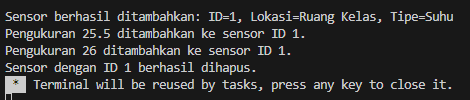
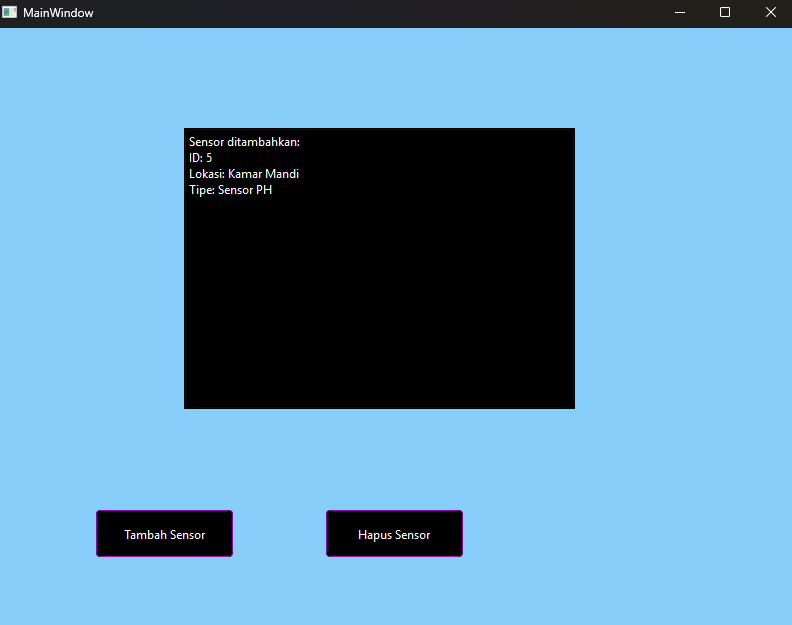
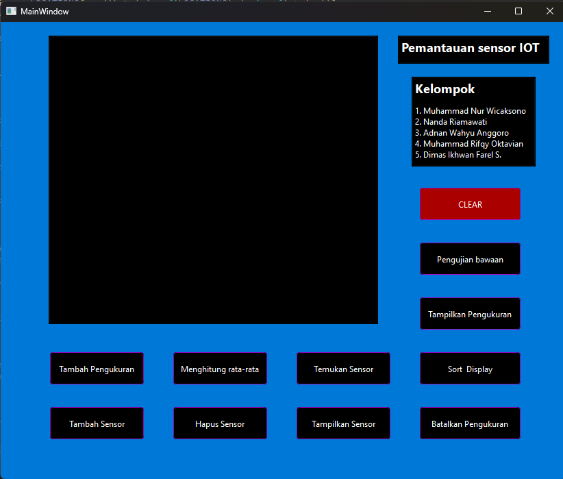

# Project-UAS

"Team Base Project Gaiso diwoco ambek compilerku, karena ada spasi"  

4 Juni 2:00 AM  

perubahan:  
-pemisahan class untuk IoTNetwork  
-fungsi main sendiri  
-sinkronisasi fungsi main dengan GUI  
-testing testing GUI  

